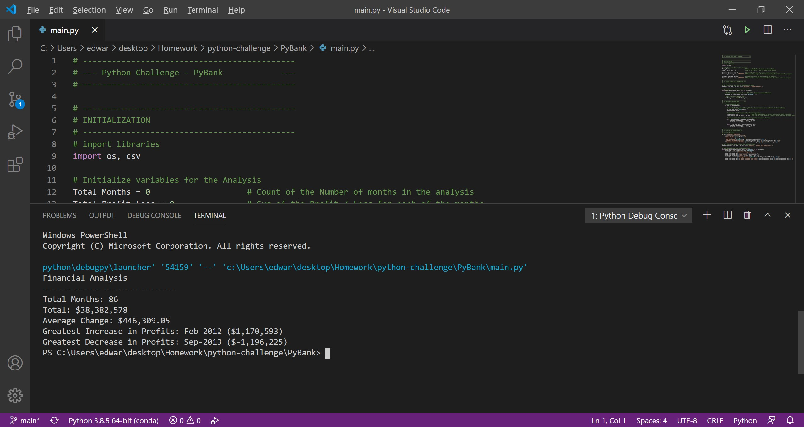
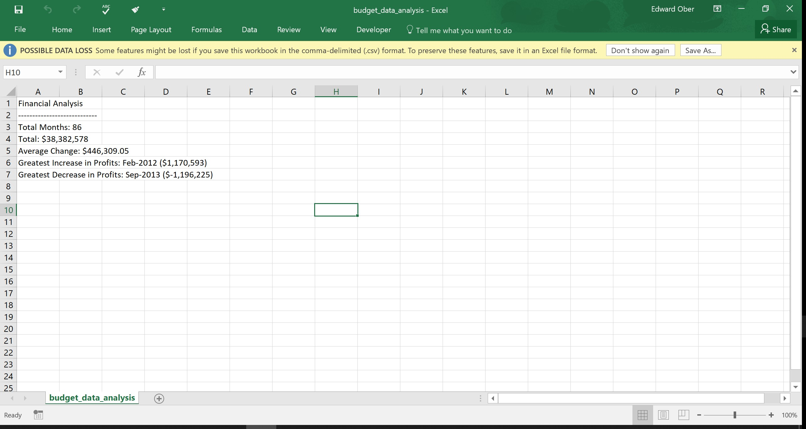
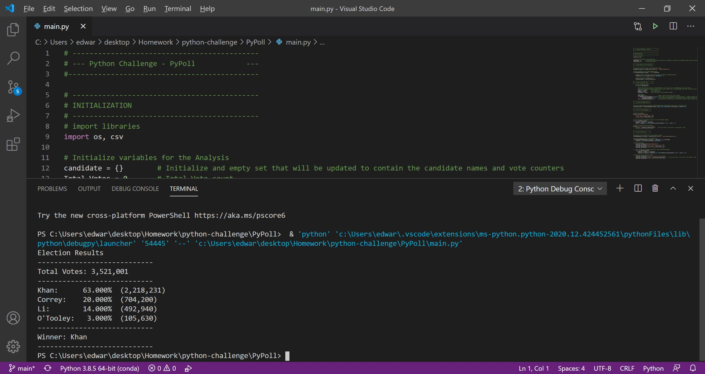
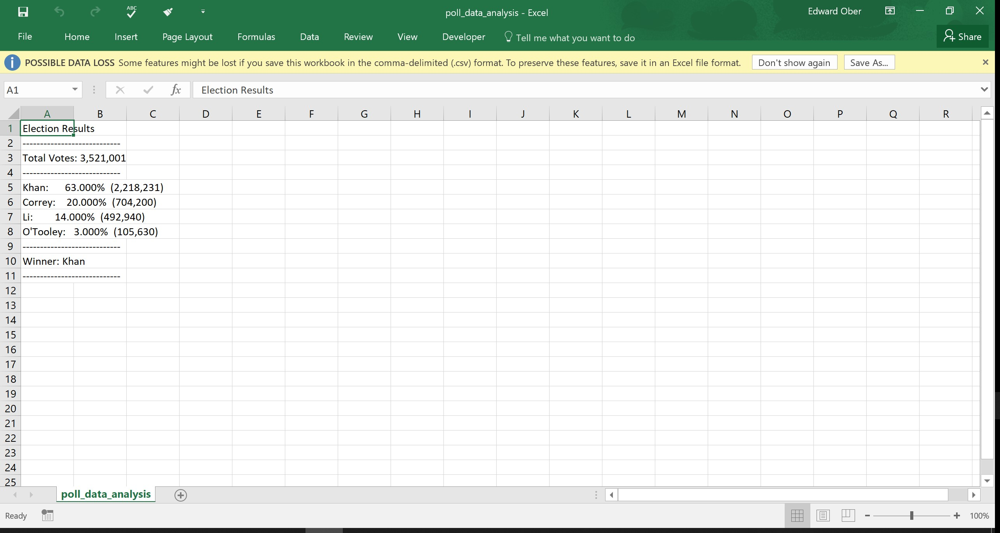

# Python Homework Submission - Py Me Up, Charlie

## Overview

This is the Python Homework submission for: Py Me Up, Charlie  

Included in this repository are: 
* Python Files that solve the homework assignments

* Screen Shots of the Terminal and CSV output showing the solutions

* An 'Other' file, which is a word document that consolidates all the screenshots 

### Files

* 2 folders with the solutions to the assignment:

  * [PyBank Code](PyBank/main.py)- reads the [bank budget data csv file](PyBank/Resources/budget_data.csv) and prints the summary output to the terminal and creates the output file [analysis.csv](PyBank/analysis/budget_data_analysis.csv)

  * [PyPoll Code](PyPoll/main.py) - reads the [polling data csv file](PyPoll/Resources/election_data.csv) and prints the summary output to the terminal and creates the output file [analysis.csv](PyPoll/analysis/poll_data_analysis.csv)

* [Screen Shots](Images) - Folder with all the screen shots (also shown below) of each output showing the final results.

* [Other](Other) - Folder with additional info  

  * [Word Doc of Screen Shots](Other/Python_PY_Me_Up_Charlie_Screenshots.docx) - Is a word document that consolidates all the screenshots for both exercises and both sets of outputs. 

  
### Screen Shots for Output

* PyBank - Terminal

* PyBank - CSV File

* PyPoll - Terminal

* PyPoll - Terminal
